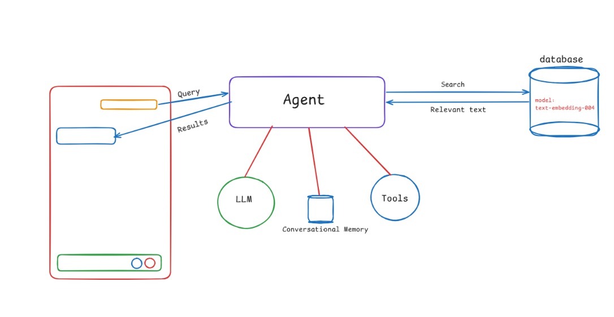
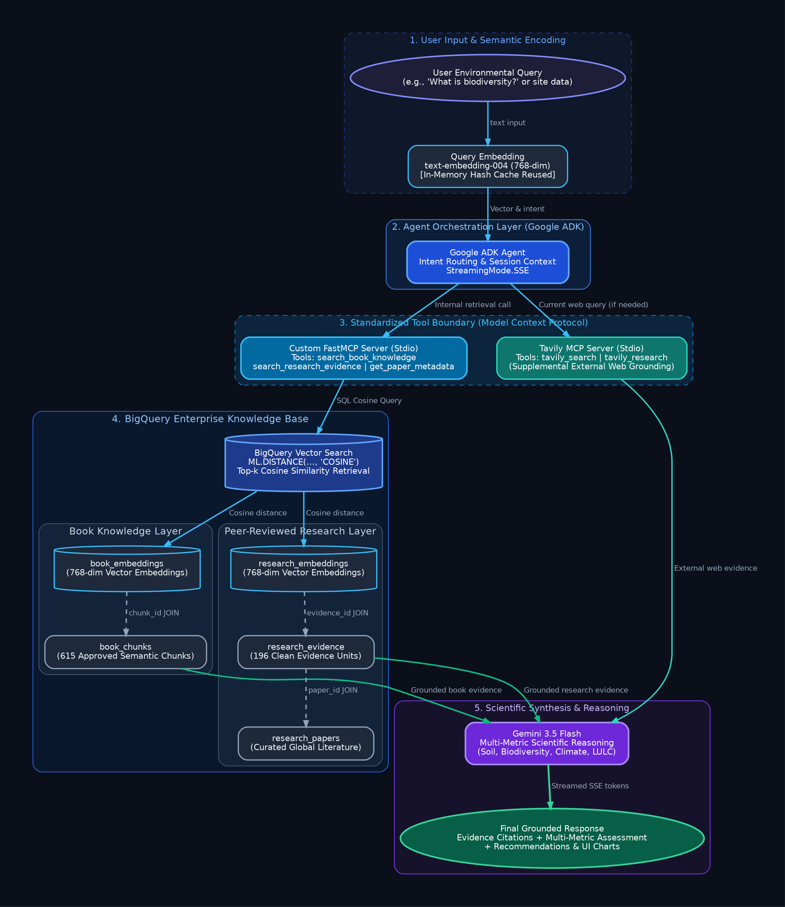

# Environmental AI Scientist — Technical Documentation

An in-depth technical manual and architectural reference for the Environmental AI Scientist system, detailing knowledge ingestion, schema definitions, vector retrieval algorithms, Model Context Protocol (MCP) tool bindings, agent orchestration, and streaming execution lifecycles.

---

## Section 1 — System Objective

The **Environmental AI Scientist** is an evidence-grounded AI system designed to solve the critical challenges of automated ecological diagnosis, agronomic consulting, and environmental risk assessment. In environmental systems, agronomic and biological variables do not operate in isolation; changes in soil management inevitably perturb microbial richness, carbon retention, and moisture resilience.

This implementation directly fulfills the technical hackathon objectives:

1. **Retrievable Knowledge Layer:** Ingests, structures, and indexes curated scientific textbooks and peer-reviewed empirical papers into a native vector search engine inside Google BigQuery.
2. **Deterministic Scientific Grounding:** Enforces strict evidence citation constraints. The model is forbidden from answering scientific questions purely from ungrounded parametric memory.
3. **Multi-Metric Scientific Reasoning:** Evaluates cross-variable trade-offs and coupled dynamics (e.g., Soil Organic Carbon, pH, Cation-Exchange Capacity, biodiversity indices, tillage regimes, and precipitation gradients).
4. **Actionable, Evidence-Backed Recommendations:** Delivers structured interventions featuring quantitative expected outcomes, estimated time horizons, and explicit limitations.
5. **Multi-Turn Contextual Interaction:** Employs session state tracking to clarify incomplete site scenarios, track iterative user constraints, and address complex follow-up questions.
6. **Dual-Channel Input Support:** Fluidly processes natural language scientific inquiries as well as structured, quantitative field diagnostic metrics (e.g., `SOC: 0.3%, rainfall: 300mm, conventional discing`).

---

## Section 2 — End-to-End Architecture

The application adopts a decoupled, multi-tier architecture separating presentation, orchestration, tool abstraction, and knowledge persistence:

```
                  ┌─────────────────────────────────────┐
                  │       Browser Web Interface         │
                  │   Responsive HTML5/Tailwind/JS      │
                  └──────────────────┬──────────────────┘
                                     │ HTTP POST & SSE Stream
                                     ▼
                  ┌─────────────────────────────────────┐
                  │       FastAPI Backend Server        │
                  │     (server.py / Starlette SSE)     │
                  └──────────────────┬──────────────────┘
                                     │ Event Generator
                                     ▼
                  ┌─────────────────────────────────────┐
                  │      Google ADK Agent Runtime       │
                  │   Session Service & Intent Router   │
                  └──────────────────┬──────────────────┘
                                     │ Invocation Loop
                                     ▼
                  ┌─────────────────────────────────────┐
                  │          Gemini 3.5 Flash           │
                  │   Function Calling & Synthesis      │
                  └──────────┬──────────────────────────┘
                             │ Tool Dispatch
              ┌──────────────┴──────────────┐
              ▼                             ▼
┌───────────────────────────┐ ┌───────────────────────────┐
│     Custom FastMCP        │ │        Tavily MCP         │
│  (Stdio Server Process)   │ │  (Stdio Server Process)   │
└─────────────┬─────────────┘ └─────────────┬─────────────┘
              │ Direct Python               │ Web API
              ▼                             ▼
┌───────────────────────────┐ ┌───────────────────────────┐
│     BigQuery Retriever    │ │    Live Web Research      │
│  ML.DISTANCE Vector Search│ │ Policy & External Trends  │
└─────────────┬─────────────┘ └─────────────┬─────────────┘
              │                             │
              └──────────────┬──────────────┘
                             │ Retrieved Evidence
                             ▼
                  ┌─────────────────────┐
                  │ Structured Response │
                  │  (Streamed via SSE) │
                  └─────────────────────┘
```

<p align="center">
  
</p>

### End-to-End Operational Lifecycle:
1. **User Request:** The client issues a POST request to `/api/conversations/{session_id}/message` containing the query string and optional client message identifiers.
2. **Immediate Connection & SSE Handshake:** FastAPI establishes a `text/event-stream` connection, registering the user message and allocating an assistant placeholder with a deterministic `request_id`.
3. **ADK Agent Loop Initiation:** The backend invokes `runner.run_async(...)` with `RunConfig(streaming_mode=StreamingMode.SSE)`.
4. **Tool Selection:** Gemini evaluates the prompt against registered tool declarations. If domain knowledge is needed, it yields a `FunctionCall` targeting `search_book_knowledge`, `search_research_evidence`, or `tavily_search`.
5. **Tool Execution over MCP:** The ADK runtime dispatches the call through the corresponding MCP Stdio client to either the Custom FastMCP server (`bq_mcp_server.py`) or the Tavily MCP server.
6. **Data Retrieval:** The BigQuery retriever executes vector cosine similarity queries in BigQuery ML.
7. **Function Response Feeding:** Tool outputs are serialized and returned as a `FunctionResponse` to ADK.
8. **Second LLM Invocation & Synthesis:** Gemini receives the retrieved evidence and streams incremental text tokens back through the SSE generator to the user interface.
9. **Final Packaging:** The backend extracts optional chart JSON blocks, constructs source attribution summaries, marks the message complete, and emits the terminal SSE `done` event.

---

## Section 3 — Knowledge & Retrieval Pipeline Diagram

The internal knowledge and vector retrieval pipeline is structured as follows:

<p align="center">
  
</p>

This pipeline ensures that:
1. Every textual document is pre-processed into an indexed vector representation before runtime.
2. At query time, vector embeddings are generated once and compared across both the textbook layer and the research evidence layer.
3. Multiple database tables are joined in a single BigQuery SQL execution, delivering rich contextual metadata along with raw text snippets.

---

## Section 4 — Knowledge Corpus

The internal corpus was selected to span both **broad conceptual environmental principles** and **rigorous, peer-reviewed empirical research**.

### 1. Ingested Books (Foundational Knowledge)
- **Introduction to Environmental Science (2025 Edition):** Comprehensive coverage of ecosystem energetics, nutrient cycles (carbon, nitrogen, phosphorus), biomes, ecological succession, and global environmental stressors.
- **Introduction to Soil Science:** Foundational soil physics, mineralogy, Soil Organic Matter (SOM) dynamics, cation-exchange processes, horizonation, and soil water regimes.
- **What is Biodiversity?:** Taxonomic, genetic, and functional diversity frameworks, extinction dynamics, habitat fragmentation, and keystone species mechanics.
- **Remote Sensing of Land Use / Land Cover (LULC) & Drought Monitoring:** Satellite-derived vegetation indices, drought indices (SPI, VCI), and anthropogenic landscape alteration.
- **Environmental Pollution & Toxicology:** Chemical pesticide persistence, heavy metal accumulation in soils, and atmospheric particulate deposition.

### 2. Peer-Reviewed Research Literature (Empirical Evidence Units)
- Meta-analyses and empirical studies curated from *Proceedings of the National Academy of Sciences (PNAS)*, *Nature Communications*, *Science of The Total Environment (STOTEN)*, *iScience*, and *Agriculture, Ecosystems & Environment*.
- Covers empirical treatment-control experiments focusing on:
  - Long-term no-till vs. conventional tillage on soil aggregate stability and invertebrate abundance.
  - Soil pH thresholds governing bacterial vs. fungal alpha diversity in agricultural soils.
  - Nitrogen fertilizer application rates and subsequent mycorrhizal fungal colonization suppression.
  - Multi-trophic consequences of selective logging and forest fragment edges.
  - Constructed wetlands for agricultural non-point source nitrogen and phosphorus removal.

### 3. Cleaning & Normalization Protocol
Raw PDFs were processed through an automated pipeline:
- **Layout & Column Parsing:** Multi-column journal layouts were linearized using spatial bounding-box algorithms.
- **Exclusion of Non-Knowledge Content:** Automated heuristic filters stripped reference bibliographies, author contact blocks, index tables, and publisher boilerplate.
- **Semantic Chunking:** Text chunks were formed around header boundaries with token constraints (400–700 tokens) and an overlap of 80 tokens to prevent contextual clipping.
- **Evidence Extraction:** Research papers were processed by scientific extractors to isolate variables, direction of effect, study design, statistical methods, and observed numerical effect sizes.

---

## Section 5 — BigQuery Schema

All knowledge tables are housed within Google BigQuery dataset `developer-491706.darukaa_kb` (or custom user dataset).

```
┌────────────────────────────────────────────────────────────────────────────┐
│                             BOOK KNOWLEDGE LAYER                           │
│                                                                            │
│   ┌──────────────────────────┐             ┌───────────────────────────┐   │
│   │     book_embeddings      │             │        book_chunks        │   │
│   ├──────────────────────────┤             ├───────────────────────────┤   │
│   │ chunk_id: STRING (PK)    ├────────────►│ chunk_id: STRING (PK)     │   │
│   │ embedding: ARRAY<FLOAT64>│  chunk_id   │ book_id: STRING           │   │
│   └──────────────────────────┘    JOIN     │ domain: STRING            │   │
│                                            │ chapter: STRING           │   │
│                                            │ section: STRING           │   │
│                                            │ page_start: INT64         │   │
│                                            │ page_end: INT64           │   │
│                                            │ content: STRING           │   │
│                                            │ topics: ARRAY<STRING>     │   │
│                                            │ source_uri: STRING        │   │
│                                            └───────────────────────────┘   │
└────────────────────────────────────────────────────────────────────────────┘

┌────────────────────────────────────────────────────────────────────────────┐
│                         RESEARCH EVIDENCE LAYER                            │
│                                                                            │
│   ┌──────────────────────────┐             ┌───────────────────────────┐   │
│   │   research_embeddings    │             │     research_evidence     │   │
│   ├──────────────────────────┤             ├───────────────────────────┤   │
│   │ evidence_id: STRING (PK) ├────────────►│ evidence_id: STRING (PK)  │   │
│   │ embedding: ARRAY<FLOAT64>│ evidence_id │ paper_id: STRING (FK)     │   │
│   └──────────────────────────┘    JOIN     │ section: STRING           │   │
│                                            │ page_start / page_end     │   │
│                                            │ evidence_text: STRING     │   │
│                                            │ variables: ARRAY<STRING>  │   │
│                                            │ relationship: STRING      │   │
│                                            │ direction: STRING         │   │
│                                            │ outcome: STRING           │   │
│                                            │ magnitude: STRING         │   │
│                                            │ study_location: STRING    │   │
│                                            │ study_period: STRING      │   │
│                                            │ study_design: STRING      │   │
│                                            │ measurement_method: STRING│   │
│                                            │ statistical_method: STRING│   │
│                                            │ limitations: ARRAY<STRING>│   │
│                                            │ topics: ARRAY<STRING>     │   │
│                                            │ source_uri: STRING        │   │
│                                            └─────────────┬─────────────┘   │
│                                                          │ paper_id        │
│                                                          │ JOIN            │
│                                                          ▼                 │
│                                            ┌───────────────────────────┐   │
│                                            │      research_papers      │   │
│                                            ├───────────────────────────┤   │
│                                            │ paper_id: STRING (PK)     │   │
│                                            │ title: STRING             │   │
│                                            │ authors: ARRAY<STRING>    │   │
│                                            │ year: INT64               │   │
│                                            │ journal: STRING           │   │
│                                            │ doi: STRING               │   │
│                                            │ study_type: STRING        │   │
│                                            │ domain: STRING            │   │
│                                            │ abstract: STRING          │   │
│                                            │ source_uri: STRING        │   │
│                                            └───────────────────────────┘   │
└────────────────────────────────────────────────────────────────────────────┘
```

### Table Details:

#### 1. `book_chunks`
- **Purpose:** Houses verified conceptual and narrative excerpts from environmental and soil textbooks.
- **Used by:** `search_book_knowledge` FastMCP tool.
- **Key Fields:** `chunk_id` (Primary Key), `book_id`, `domain` (e.g., SOIL_SCIENCE, BIODIVERSITY), `chapter`, `section`, `page_start`, `page_end`, `content` (plain text content chunk), `topics` (string array of taxonomic tags), `source_uri`.

#### 2. `book_embeddings`
- **Purpose:** Stores the 768-dimensional dense vector embeddings corresponding to each textbook chunk.
- **Used by:** `search_book_knowledge` vector distance queries.
- **Key Fields:** `chunk_id` (Foreign Key referencing `book_chunks.chunk_id`), `embedding` (`ARRAY<FLOAT64>` of length 768).

#### 3. `research_papers`
- **Purpose:** Master catalog of ingested scientific journal articles.
- **Used by:** `get_paper_metadata` and `search_research_evidence` (via join).
- **Key Fields:** `paper_id` (Primary Key), `title`, `authors` (`ARRAY<STRING>`), `year`, `journal`, `doi`, `study_type` (e.g., META_ANALYSIS, FIELD_EXPERIMENT), `domain`, `abstract`, `source_uri`.

#### 4. `research_evidence`
- **Purpose:** Granular, empirically verified findings extracted from peer-reviewed publications.
- **Used by:** `search_research_evidence` FastMCP tool.
- **Key Fields:** `evidence_id` (Primary Key), `paper_id` (Foreign Key referencing `research_papers.paper_id`), `evidence_text`, `variables` (`ARRAY<STRING>` representing tracked indicators), `relationship` (e.g., POSITIVE, NEGATIVE, THRESHOLD), `direction`, `outcome`, `magnitude` (quantitative effect size), `study_location`, `study_period`, `study_design`, `measurement_method`, `statistical_method`, `limitations` (`ARRAY<STRING>`), `topics`.

#### 5. `research_embeddings`
- **Purpose:** Stores the 768-dimensional dense vector embeddings corresponding to each research evidence unit.
- **Used by:** `search_research_evidence` vector distance queries.
- **Key Fields:** `evidence_id` (Foreign Key referencing `research_evidence.evidence_id`), `embedding` (`ARRAY<FLOAT64>` of length 768).

---

## Section 6 — Vector Retrieval Engine

Vector retrieval is executed directly within BigQuery using native BigQuery ML vector distance routines:

### Retrieval Algorithm
1. **Query Normalization & Hash Caching:** The query is trimmed and hashed (`MD5(query)[:12]`). The memory cache is checked for an existing embedding vector.
2. **Embedding Generation:** On cache miss, BigQuery ML generates the embedding via:
   ```sql
   SELECT ml_generate_embedding_result AS vec
   FROM ML.GENERATE_EMBEDDING(
     MODEL `your-project.your-dataset.embedding_model`,
     (SELECT @query_text AS content)
   )
   ```
   The resulting vector is stored in the local cache for subsequent reuse.
3. **Cosine Distance Evaluation:** Vector similarity is computed in BigQuery ML using:
   ```sql
   ML.DISTANCE(e.embedding, @query_vector, 'COSINE') AS cosine_distance
   ```
   Cosine distance $\in [0, 2]$ is mapped to cosine similarity $\in [-1, 1]$:
   $$\text{Cosine Similarity} = 1.0 - \text{Cosine Distance}$$
4. **SQL Projection & Join:** The query performs a single-pass join between the embedding table and the content tables, ordering by `cosine_distance ASC` and limiting by `top_k`.
5. **No Separate Vector Database:** The system eliminates synchronization lag and operational complexity by avoiding third-party vector databases. Vector storage, metadata filtering, and relational joins execute in a unified transaction in BigQuery.

---

## Section 7 — Custom FastMCP Server

The project introduces a dedicated FastMCP server (`mcp_servers/bq_mcp_server.py`) communicating over standard input/output (Stdio).

### Architectural Rationale
- **Isolation of Data Access Logic:** The agent prompt and reasoning engine contain no SQL queries, GCP project identifiers, or database credentials.
- **Enforced Tool Contracts:** Exposes strict schemas validated via Pydantic models:
  - `search_book_knowledge`: `{ query: string, top_k: integer }`
  - `search_research_evidence`: `{ query: string, top_k: integer }`
  - `get_paper_metadata`: `{ paper_id_or_title: string }`
- **Observability Hook:** Every call through FastMCP emits standardized diagnostic log frames (`[MCP][TOOL][START]`, `[MCP][TOOL][END]`, `duration_ms`, `tables_accessed`) intercepted by the backend SSE stream.

---

## Section 8 — ADK Agent Configuration

The agent is defined using **Google ADK (version 1.39.1)** in [`environmental_scientist/agent.py`](file:///home/shivakumarullagaddi855/agriculture_rag/implimentation/environmental_scientist/agent.py):

```python
root_agent = Agent(
    name="environmental_scientist",
    model="gemini-3.5-flash",
    description="Evidence-grounded AI Environmental Scientist providing multi-metric scientific reasoning...",
    instruction=ENVIRONMENTAL_SCIENTIST_SYSTEM_INSTRUCTION,
    tools=_tools,
)
```

### Key Execution Behaviors:
- **Streaming Mode:** Configured with `StreamingMode.SSE` for real-time token delivery.
- **Progressive SSE Processing:** Consumes native ADK event streams where incremental tokens are yielded with `partial=True` and aggregated terminal states are handled cleanly with `partial=False`.
- **Multi-Step Autonomy:** The ADK runner coordinates the complete tool execution turn:
  $$\text{User Input} \longrightarrow \text{Gemini FunctionCall} \longrightarrow \text{FastMCP Execution} \longrightarrow \text{FunctionResponse} \longrightarrow \text{Gemini Synthesis}$$

---

## Section 9 — Tavily MCP Integration

External scientific research is powered by Tavily MCP (`tavily-mcp` executed via `npx` over Stdio):

### Supported Tool Declarations:
1. **`tavily_search(query: str)`:** Real-time web search tuned for scientific articles, environmental policy updates, and government releases.
2. **`tavily_research(query: str)`:** Deep multi-source web synthesis across academic, institutional, and intergovernmental bodies.
3. **`tavily_extract(urls: list[str])`:** Pulls clean markdown text from specified scientific reports or regulatory publications.

### Trigger Logic:
The agent triggers Tavily when:
- Queries cite recent years (e.g., "2024–2026 targets", "current COP decisions").
- Queries target specific global organizations (e.g., IPBES, UNFCCC, FAO, IPCC) for non-textbook policy data.
- The user explicitly requests live web verification.

---

## Section 10 — In-Memory Multi-Tier Cache Architecture

The retriever implements four distinct in-memory hash caches in [`retrieval/bigquery_retriever.py`](file:///home/shivakumarullagaddi855/agriculture_rag/implimentation/retrieval/bigquery_retriever.py):

| Cache | Key Format | Value Stored | Latency Impact |
| :--- | :--- | :--- | :--- |
| **Query Embedding Cache** | `normalized_query: str` | 768-dim `List[float]` | Cuts query latency from ~3.5s to < 1ms |
| **Book Retrieval Cache** | `(normalized_query, top_k)` | Deep-copied `List[Dict]` | Eliminates repeated 1.5s BigQuery vector scans |
| **Research Retrieval Cache** | `(normalized_query, top_k)` | Deep-copied `List[Dict]` | Eliminates repeated 1.9s BigQuery vector scans |
| **Paper Metadata Cache** | `normalized_key: str` | Deep-copied `List[Dict]` | Instant metadata lookups |

All cache entries are populated transparently on cache misses and emit diagnostic telemetry logs (`[RETRIEVER][CACHE] HIT/MISS`).

---

## Section 11 — Session & Conversation Management

### Session State vs. Retrieval Cache
- **Session State (`_conversations` in `server.py`):**
  - Keyed by `session_id`.
  - Maintains chronological message history (`user` and `assistant` turns).
  - Associates each turn with a unique `request_id` for deterministic tracing.
  - Passed to Google ADK's `InMemorySessionService` to give Gemini multi-turn conversational memory.
- **Retrieval Cache:**
  - Exists globally on the singleton `BigQueryRetriever` instance.
  - Decoupled from user sessions; shared across all conversations. If User B asks the same scientific question previously asked by User A, the embedding and retrieval results are served instantly from memory.

---

## Section 12 — Output Design by Intent

The agent dynamically shapes its response structure based on the inferred query intent:

### 1. Foundational Intent
- **Structure:** Clear Definition $\rightarrow$ Underlying Ecological Mechanics $\rightarrow$ Soil/Biological Significance $\rightarrow$ Source Citations.
- **Style:** Clear, precise, academic yet accessible.

### 2. Research Intent
- **Structure:** Scientific Executive Summary $\rightarrow$ Quantitative Evidence & Findings (sample sizes, correlations, $p$-values where available) $\rightarrow$ Study Methodologies $\rightarrow$ Limitations $\rightarrow$ Formal Citations.

### 3. Diagnostic & Recommendation Intent
- **Structure:**
  1. **Comprehensive Assessment:** Multi-metric baseline evaluation.
  2. **Intervention Recommendations:** Prioritized, step-by-step land management practices.
  3. **Impacted Ecological Metrics:** Explicit expected trajectories (e.g., *SOC $\uparrow 0.15\%$ in 3 years; earthworm density $\uparrow 30\%$; fungal:bacterial ratio normalized*).
  4. **Time Horizon:** Short-term (1–2 seasons), Medium-term (3–5 years), Long-term (10+ years).
  5. **Limitations & Uncertainties:** Site constraints, climate risk factors, and monitoring suggestions.
  6. **Evidence Citations:** Direct mapping to underlying books and papers.

---

## Section 13 — Retrieval & Tool Trace Observability

The system rejects black-box AI behavior. Every request surfaces live diagnostic metadata over SSE:

```json
{
  "request_id": "req-7f8a9b",
  "session_id": "sess-1234",
  "type": "done",
  "status": "complete",
  "intent": "Diagnostic",
  "tools_used": ["search_book_knowledge", "search_research_evidence"],
  "tool_trace": [
    {
      "tool_name": "search_book_knowledge",
      "source_type": "BOOK",
      "duration_sec": 5.4,
      "result_count": 5,
      "tables": ["book_embeddings", "book_chunks"]
    },
    {
      "tool_name": "search_research_evidence",
      "source_type": "RESEARCH",
      "duration_sec": 1.9,
      "result_count": 5,
      "tables": ["research_embeddings", "research_evidence", "research_papers"]
    }
  ],
  "sources": [
    {
      "title": "Introduction to Soil Science",
      "type": "BOOK",
      "detail": "Chapter 4: Soil Organic Matter and Biological Activity, pp. 88-94"
    },
    {
      "title": "Global meta-analysis of no-till impacts on soil biota",
      "type": "RESEARCH",
      "detail": "PNAS, 2022 (doi: 10.1073/pnas.xxxxx)"
    }
  ],
  "total_latency_sec": 7.3
}
```

*Note: Raw internal chain-of-thought tokens and system prompts are never leaked into the trace.*

---

## Section 14 — Example End-to-End Traces

### Trace 1: Research Inquiry
- **User:** *"What does global scientific research show regarding soil pH and bacterial alpha diversity?"*
- **Intent Recognized:** `Research`
- **Tool Dispatched:** `search_research_evidence(query='soil pH and bacterial alpha diversity richness', top_k=5)`
- **BigQuery Action:** Cosine similarity join across `research_embeddings`, `research_evidence`, and `research_papers`.
- **Retrieved Evidence:** Meta-analyses identifying unimodal (bell-shaped) relationships between soil pH and bacterial richness, peaking near neutral pH ($6.5 - 7.5$) and dropping sharply in acidic soils ($< 5.0$).
- **Gemini Synthesis:** Delivers a peer-reviewed scientific overview citing specific studies, explaining physiological enzymatic constraints at low pH, and noting fungal dominance in acidic profiles.

### Trace 2: International Policy Inquiry
- **User:** *"What are the current international biodiversity policy targets under the Kunming-Montreal framework?"*
- **Intent Recognized:** `Current/External`
- **Tool Dispatched:** `tavily_search(query='Kunming-Montreal Global Biodiversity Framework 2030 targets')`
- **Tavily Action:** Queries live global news and official UN Convention on Biological Diversity documentation.
- **Retrieved Evidence:** Target 3 (30x30 protected areas), Target 2 (restoration of 30% degraded ecosystems), Target 10 (sustainable agriculture and agroecology).
- **Gemini Synthesis:** Summarizes the 23 action targets for 2030, emphasizing conservation targets directly relevant to agricultural landscapes.

### Trace 3: Structured Diagnostic Site Scenario
- **User:** `SOC: 0.3%, soil: sandy loam, rainfall: 320mm, continuous wheat monoculture with deep disc tillage.`
- **Intent Recognized:** `Diagnostic / Site-Specific`
- **Tools Dispatched:** `search_book_knowledge` (for semi-arid organic matter kinetics) and `search_research_evidence` (for dryland conservation tillage meta-analyses).
- **Multi-Metric Reasoning:**
  - Evaluates low precipitation ($320\text{ mm}$) $\rightarrow$ biological decomposition is water-limited.
  - Deep disc tillage in semi-arid sandy loam $\rightarrow$ destroys macro-aggregates and accelerates carbon volatilization.
  - Recommends: Stubble retention, transition to direct drill / no-till, winter cover crops (e.g., vetch or rye if moisture allows).
- **Visual Chart Generation:** Yields a comparative metric trajectory chart comparing projected SOC and biological richness under Status Quo vs. Conservation Intervention.

---

## Section 15 — Why This Is Not an LLM-Only Chatbot

General LLM chatbots suffer from significant vulnerabilities when answering scientific and agronomic queries:
1. **Hallucination of Numerical Baselines:** LLMs frequently fabricate specific soil thresholds or misquote empirical magnitudes.
2. **Outdated Information:** Parametric memory cannot account for recent scientific revisions or recent environmental frameworks.
3. **Absence of Accountability:** General chatbots cannot cite the exact textbook page, table, or journal DOI supporting an assertion.

The **Environmental AI Scientist** enforces an evidence-first contract:
- Every recommendation must trace directly to an ingested book chunk or research evidence record.
- Inferences across variables must reference established ecological principles retrieved during the active turn.
- Tool traces are explicitly displayed to the user, providing transparent scientific provenance.

---

## Section 16 — Limitations & Boundary Constraints

- **Absence of Localized IoT Telemetry:** The internal knowledge base contains foundational books and peer-reviewed literature. It does *not* query local weather station APIs or in-situ soil moisture sensor feeds unless provided directly by the user in the prompt.
- **Geographic Representation of Literature:** Global meta-analyses frequently exhibit higher representation in temperate North American and European agricultural zones; semi-arid and tropical recommendations are qualified with appropriate scientific uncertainty.
- **User-Supplied Site Context Dependency:** The diagnostic depth of recommendations depends strictly on the granularity of user-provided site parameters.

---

## Section 17 — Local Development & Verification

### Directory Layout
```
agriculture_rag/
├── README.md                          # Hackathon overview & executive documentation
├── documentation.md                   # Comprehensive technical manual (this document)
├── architecture.png                   # System architecture diagram
├── knowledge_retrieval_architecture.png # Knowledge and retrieval pipeline diagram
├── data_cleaning/                     # Ingestion & data processing scripts
│   ├── pipeline.sh                    # Automated cleaning pipeline
│   ├── scripts/                       # Parsing, chunking, and BigQuery load scripts
│   └── sql/                           # Table DDL definitions and embeddings generation
└── implimentation/                    # Application runtime
    ├── .env                           # Local environment configuration (git-ignored)
    ├── server.py                      # FastAPI application with SSE streaming
    ├── config.py                      # Unified configuration loader
    ├── environmental_scientist/       # Agent package
    │   ├── agent.py                   # ADK Root Agent definition
    │   └── prompt.py                  # Scientific system instruction
    ├── retrieval/                     # BigQuery vector search engine
    │   └── bigquery_retriever.py      # Vector search with multi-tier in-memory cache
    ├── tools/                         # MCP Toolset integrations
    │   ├── bigquery_tools.py          # FastMCP client wrapper
    │   └── tavily_tool.py             # Tavily MCP client wrapper
    ├── mcp_servers/                   # MCP Server implementations
    │   └── bq_mcp_server.py           # Custom FastMCP server over Stdio
    └── static/                        # Frontend assets (HTML, CSS, JS)
```

### Running the Backend Server
From `implimentation/`:
```bash
python3 -m uvicorn server:app --host 0.0.0.0 --port 8000 --reload
```

---

## Section 18 — Future Extensions

1. **Geospatial Coordinates Integration:** Enabling users to provide latitude/longitude coordinates to automatically pull regional soil taxonomy (USDA SSURGO / ISRIC World Soil Information) and historical satellite vegetation indices.
2. **Persistent Enterprise Cache:** Transitioning in-memory hash caches to a Redis cluster for horizontal multi-instance scaling.
3. **Advanced Quantitative Scenario Modeling:** Embedding biophysical simulation modules (e.g., APSIM, DSSAT, or DayCent) into the MCP toolset to model crop yield and carbon sequestration curves dynamically.
